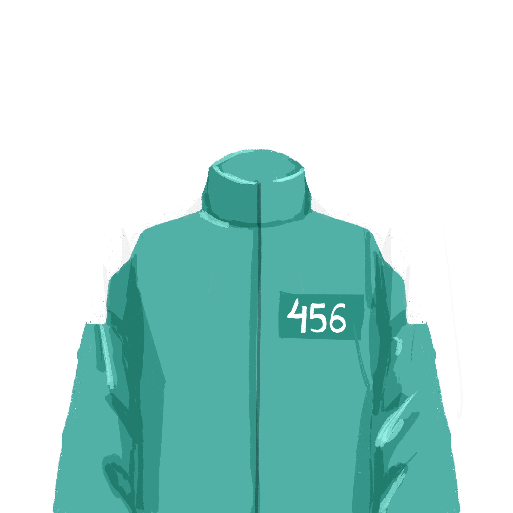
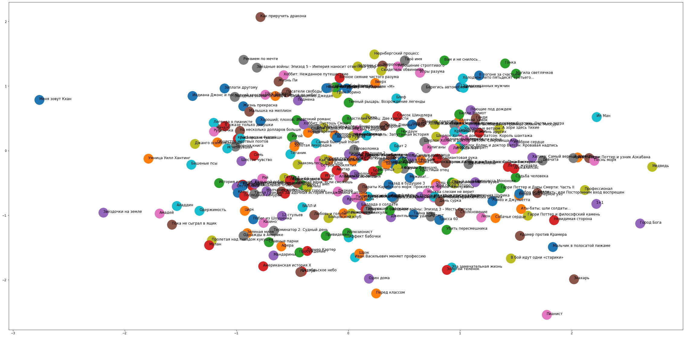
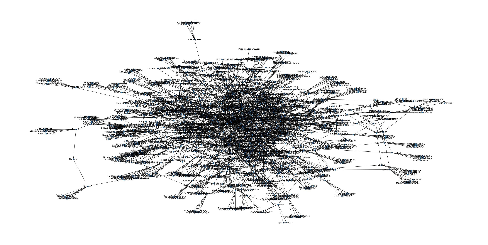

  

 

# SQUIZ - Recomendation System on Graph

* Using Graphs
* Popular Content

This example shows how to build a recommender system using graphs. First example based on standard relationships in graphs(NetworkX). The second example based on the construction of embeddings at the level of graph vertices (Node2Vec).

